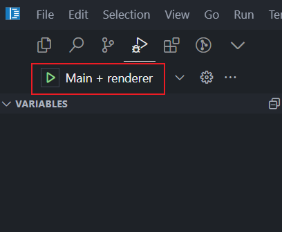

# 窗口右侧滑出剪贴板历史记录

## 开发流程

node 版本 v20

### 安装依赖

```npm install```

### 启动react项目

```npm run dev```

### 打包react项目

```npm run build:react```

### 打包electron项目

```npm run build:electron```

### 启动electron



